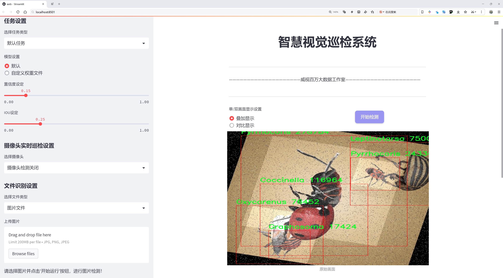
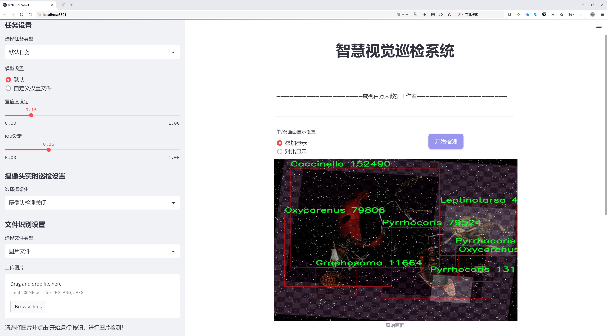
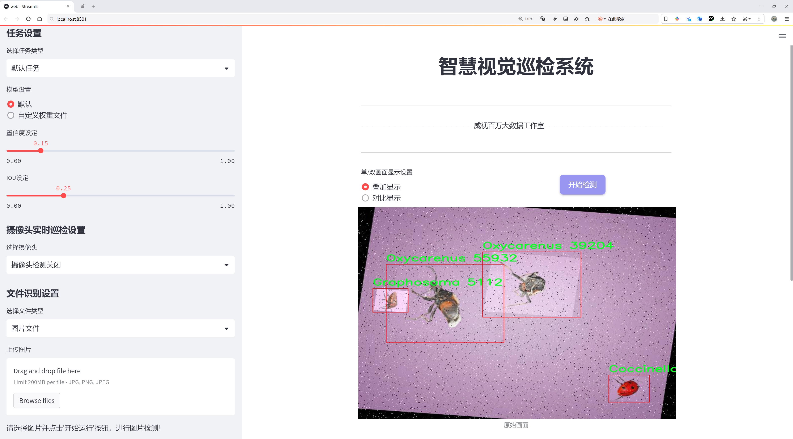
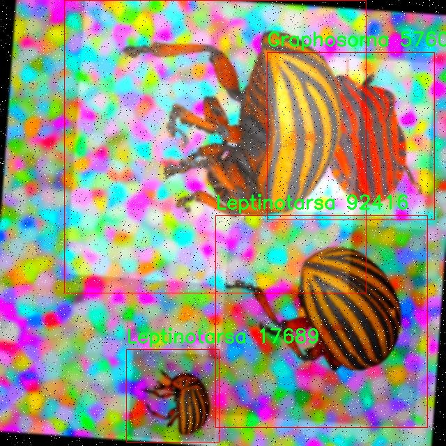
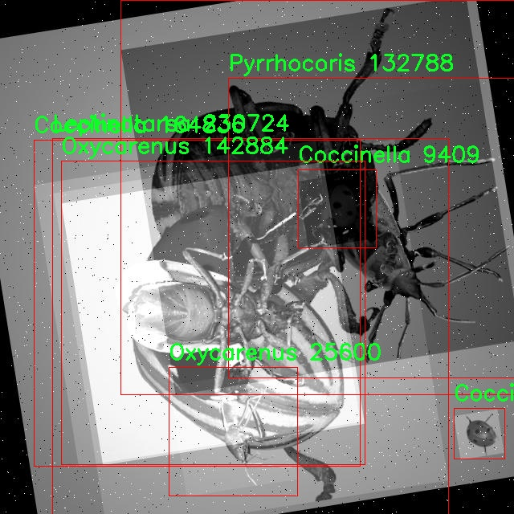
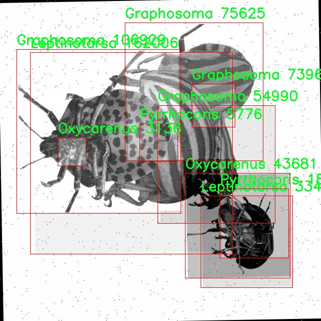
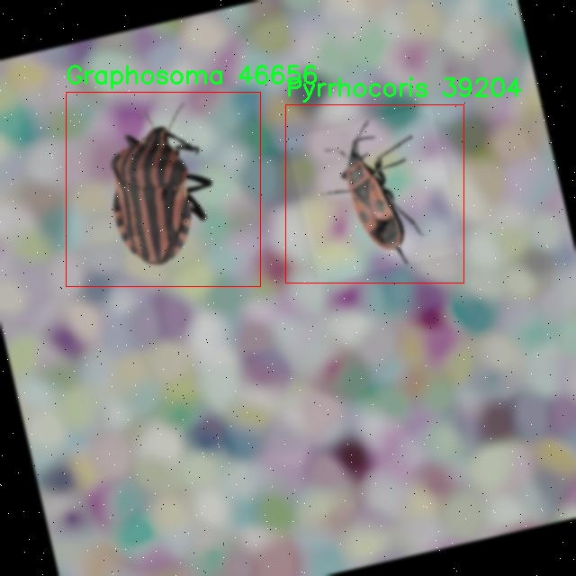
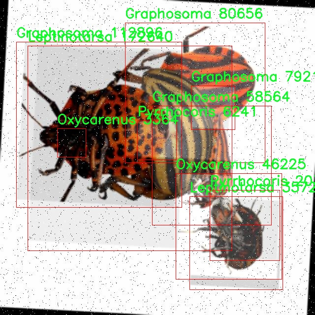

# 昆虫检测与分类检测系统源码分享
 # [一条龙教学YOLOV8标注好的数据集一键训练_70+全套改进创新点发刊_Web前端展示]

### 1.研究背景与意义

项目参考[AAAI Association for the Advancement of Artificial Intelligence](https://gitee.com/qunshansj/projects)

项目来源[AACV Association for the Advancement of Computer Vision](https://gitee.com/qunmasj/projects)

研究背景与意义

随着生态环境保护意识的不断增强，昆虫作为生态系统的重要组成部分，其监测与分类研究逐渐受到重视。昆虫不仅在生态平衡中扮演着关键角色，还对农业生产、植物授粉及病虫害防治等方面具有重要影响。然而，传统的昆虫检测与分类方法往往依赖于人工观察和专业知识，效率低下且容易受到主观因素的影响。因此，利用计算机视觉和深度学习技术，尤其是基于YOLO（You Only Look Once）系列的目标检测模型，来实现高效、准确的昆虫检测与分类，成为了一个重要的研究方向。

YOLOv8作为YOLO系列中的最新版本，具备了更高的检测精度和更快的处理速度，适合于实时应用场景。通过对YOLOv8进行改进，可以进一步提升其在昆虫检测与分类任务中的表现。针对特定的昆虫种类和特征，设计合适的改进策略，将有助于提高模型的泛化能力和适应性，从而在实际应用中实现更高的准确率和召回率。尤其是在面对复杂背景和多样化昆虫种类时，改进后的YOLOv8模型能够更好地提取特征，减少误检和漏检现象。

本研究将基于“3D_Bugs”数据集进行昆虫检测与分类的实验。该数据集包含5500张图像，涵盖了6个不同的昆虫类别，其中包括Oxycarenus等重要种类。这一数据集的丰富性和多样性为模型的训练和验证提供了良好的基础。通过对这些图像进行标注和分析，可以为模型提供充足的样本数据，进而提升其学习效果和分类性能。此外，数据集中不同类别的昆虫图像将有助于模型在特征提取时进行有效的对比学习，从而提高分类的准确性。

昆虫检测与分类系统的构建，不仅能够为生态研究提供数据支持，还能为农业生产提供科学依据。例如，通过实时监测昆虫种群的变化，可以及时发现潜在的害虫威胁，从而采取相应的防治措施，减少农作物损失。同时，该系统还可以应用于生物多样性监测、生态环境评估等领域，为生态保护提供重要的数据支持和决策依据。

综上所述，基于改进YOLOv8的昆虫检测与分类系统的研究，具有重要的理论意义和实践价值。通过提升昆虫检测的自动化水平和准确性，不仅可以推动计算机视觉技术在生态学领域的应用，还能为实现可持续发展目标贡献力量。未来，随着技术的不断进步和数据集的不断丰富，昆虫检测与分类系统将有望在更广泛的领域中发挥重要作用，促进生态环境的保护与恢复。

### 2.图片演示







##### 注意：由于此博客编辑较早，上面“2.图片演示”和“3.视频演示”展示的系统图片或者视频可能为老版本，新版本在老版本的基础上升级如下：（实际效果以升级的新版本为准）

  （1）适配了YOLOV8的“目标检测”模型和“实例分割”模型，通过加载相应的权重（.pt）文件即可自适应加载模型。

  （2）支持“图片识别”、“视频识别”、“摄像头实时识别”三种识别模式。

  （3）支持“图片识别”、“视频识别”、“摄像头实时识别”三种识别结果保存导出，解决手动导出（容易卡顿出现爆内存）存在的问题，识别完自动保存结果并导出到tempDir中。

  （4）支持Web前端系统中的标题、背景图等自定义修改，后面提供修改教程。

  另外本项目提供训练的数据集和训练教程,暂不提供权重文件（best.pt）,需要您按照教程进行训练后实现图片演示和Web前端界面演示的效果。

### 3.视频演示

[3.1 视频演示](https://www.bilibili.com/video/BV1hMpWeNEQJ/)

### 4.数据集信息展示

##### 4.1 本项目数据集详细数据（类别数＆类别名）

nc: 5
names: ['Coccinella', 'Graphosoma', 'Leptinotarsa', 'Oxycarenus', 'Pyrrhocoris']


##### 4.2 本项目数据集信息介绍

数据集信息展示

在本研究中，我们采用了名为“3D_Bugs”的数据集，以改进YOLOv8模型在昆虫检测与分类任务中的表现。该数据集专注于五种特定的昆虫类别，分别为瓢虫（Coccinella）、斑衣蜡蝉（Graphosoma）、黄毒蛾（Leptinotarsa）、草蝽（Oxycarenus）和红虫（Pyrrhocoris）。这些昆虫不仅在生态系统中扮演着重要角色，而且在农业和生物多样性研究中也具有显著的研究价值。

“3D_Bugs”数据集的构建过程经过精心设计，旨在提供高质量的图像数据，以便于训练深度学习模型。每个类别的昆虫样本均经过精确标注，确保在模型训练过程中能够有效地进行目标检测和分类。数据集中的图像来源多样，涵盖了不同的拍摄角度、光照条件和背景环境，从而增强了模型的泛化能力。这种多样性不仅有助于提高模型在实际应用中的鲁棒性，也使得模型能够适应不同的环境和条件。

在数据集的准备过程中，研究团队特别关注了图像的分辨率和清晰度，以确保每个昆虫的特征能够被准确捕捉。数据集中的图像分辨率普遍较高，这为后续的特征提取和模型训练提供了良好的基础。此外，数据集还包含了昆虫在不同生长阶段和不同性别的样本，进一步丰富了数据的多样性。这种多样性使得模型能够学习到更为复杂的特征，从而在分类时做出更为准确的判断。

为了评估模型的性能，我们将“3D_Bugs”数据集划分为训练集、验证集和测试集。训练集用于模型的训练，验证集用于调优模型参数，而测试集则用于最终的性能评估。这样的划分方式确保了模型在训练过程中不会过拟合，并能够在未见过的数据上进行有效的推断。

在实际应用中，改进后的YOLOv8模型将能够快速而准确地检测和分类这五种昆虫，为生态监测、农业害虫管理和生物多样性保护提供有力支持。通过对“3D_Bugs”数据集的深入分析和应用，我们期望能够推动昆虫检测与分类技术的发展，为相关领域的研究提供新的思路和方法。

总之，“3D_Bugs”数据集为昆虫检测与分类提供了一个坚实的基础，其丰富的样本和高质量的标注将极大地促进YOLOv8模型的训练和优化。随着技术的不断进步，我们相信这一数据集将在未来的研究中发挥越来越重要的作用，推动昆虫生态学、农业科学及相关领域的进一步发展。











### 5.全套项目环境部署视频教程（零基础手把手教学）

[5.1 环境部署教程链接（零基础手把手教学）](https://www.ixigua.com/7404473917358506534?logTag=c807d0cbc21c0ef59de5)


[5.2 安装Python虚拟环境创建和依赖库安装视频教程链接（零基础手把手教学）](https://www.ixigua.com/7404474678003106304?logTag=1f1041108cd1f708b01a)

### 6.手把手YOLOV8训练视频教程（零基础小白有手就能学会）

[6.1 手把手YOLOV8训练视频教程（零基础小白有手就能学会）](https://www.ixigua.com/7404477157818401292?logTag=d31a2dfd1983c9668658)

### 7.70+种全套YOLOV8创新点代码加载调参视频教程（一键加载写好的改进模型的配置文件）

[7.1 70+种全套YOLOV8创新点代码加载调参视频教程（一键加载写好的改进模型的配置文件）](https://www.ixigua.com/7404478314661806627?logTag=29066f8288e3f4eea3a4)

### 8.70+种全套YOLOV8创新点原理讲解（非科班也可以轻松写刊发刊，V10版本正在科研待更新）

由于篇幅限制，每个创新点的具体原理讲解就不一一展开，具体见下列网址中的创新点对应子项目的技术原理博客网址【Blog】：


[8.1 70+种全套YOLOV8创新点原理讲解链接](https://gitee.com/qunmasj/good)

### 9.系统功能展示（检测对象为举例，实际内容以本项目数据集为准）

图9.1.系统支持检测结果表格显示

  图9.2.系统支持置信度和IOU阈值手动调节

  图9.3.系统支持自定义加载权重文件best.pt(需要你通过步骤5中训练获得)

  图9.4.系统支持摄像头实时识别

  图9.5.系统支持图片识别

  图9.6.系统支持视频识别

  图9.7.系统支持识别结果文件自动保存

  图9.8.系统支持Excel导出检测结果数据


### 10.原始YOLOV8算法原理

原始YOLOv8算法原理

YOLOv8作为YOLO系列的最新版本，承载着对目标检测领域的重大创新与改进。其设计理念旨在实现快速、准确且易于使用的目标检测，广泛适用于图像分割和图像分类等任务。YOLOv8的网络结构主要由输入层、主干网络、特征融合层和解耦头构成，结合了YOLOv5和YOLOv7的优点，并引入了一些新的功能和改进，使其在性能和灵活性上进一步提升。

在输入层，YOLOv8默认的图像尺寸为640x640，但为了适应不同长宽比的图像，采用了自适应图片缩放的策略。这种方法通过将长边按比例缩小到指定尺寸，然后对短边进行填充，从而减少信息冗余，提升目标检测和推理的速度。此外，YOLOv8在训练过程中引入了马赛克增强（Mosaic），通过随机将四张图像拼接成一张新图像，迫使模型学习不同位置和周围像素的特征，显著提高了模型的预测精度。

主干网络部分，YOLOv8在设计上参考了YOLOv7中的ELAN模块，将YOLOv5中的C3模块替换为C2f模块。C2f模块通过增加更多的残差连接，能够在保证轻量化的基础上，获取更丰富的梯度信息，从而提升检测精度。C2f模块的结构由多个CBS（卷积+归一化+SiLU激活）模块和若干个Bottleneck模块组成，确保了输入输出特征图的尺寸一致性，并通过控制最短和最长的梯度路径，增强了网络的特征提取能力。

特征融合层采用了PAN-FPN（Path Aggregation Network with Feature Pyramid Network）结构，旨在实现多尺度信息的深度融合。YOLOv8在此基础上进行了优化，去除了上采样阶段的1x1卷积连接层，直接将高层特征进行上采样并与中层特征进行拼接。这样的设计使得不同层次的特征能够充分融合，从而提高目标检测的准确性和鲁棒性。

在头部结构方面，YOLOv8采用了解耦头（Decoupled Head）设计，分别处理分类和回归任务，取消了以往的Anchor-Based方法，转而采用Anchor-Free的思想。这一转变使得YOLOv8能够将目标检测转化为关键点检测，简化了网络结构，提高了模型的泛化能力。解耦头的输出特征图经过Softmax和卷积计算后，能够将预测结果转换为边框格式，并结合Distribution Focal Loss和CIoU Loss进行损失计算，以更好地处理样本不平衡问题。

在损失函数方面，YOLOv8使用了BCELoss作为分类损失，DFLLoss和CIoULoss作为回归损失。这种设计不仅提高了网络的收敛速度，还增强了对小目标的检测能力，特别是在面对目标较小且占比不大的场景时，Focal Loss的引入有效地解决了正负样本不平衡的问题。

YOLOv8的整体架构体现了深度学习领域对目标检测算法的持续探索与创新。通过引入新的模块和优化现有结构，YOLOv8在检测精度、速度和模型复杂度之间达成了良好的平衡。尤其是在实际应用中，YOLOv8展现出了优越的性能，使其成为目标检测任务中的一个重要选择。随着YOLOv8的发布，目标检测的研究和应用将迎来新的机遇与挑战，推动这一领域的进一步发展。


### 11.项目核心源码讲解（再也不用担心看不懂代码逻辑）

#### 11.1 code\ultralytics\models\fastsam\predict.py

以下是对代码的核心部分进行提炼和详细注释的结果：

```python
# 导入必要的库
import torch
from ultralytics.engine.results import Results
from ultralytics.models.fastsam.utils import bbox_iou
from ultralytics.models.yolo.detect.predict import DetectionPredictor
from ultralytics.utils import ops

class FastSAMPredictor(DetectionPredictor):
    """
    FastSAMPredictor类专门用于在Ultralytics YOLO框架中进行快速SAM（Segment Anything Model）分割预测任务。
    该类继承自DetectionPredictor，定制了预测管道，特别适用于快速SAM。
    """

    def __init__(self, cfg=DEFAULT_CFG, overrides=None, _callbacks=None):
        """
        初始化FastSAMPredictor类，设置任务为'segment'。
        
        Args:
            cfg (dict): 预测的配置参数。
            overrides (dict, optional): 可选的参数覆盖，用于自定义行为。
            _callbacks (dict, optional): 在预测过程中调用的可选回调函数列表。
        """
        super().__init__(cfg, overrides, _callbacks)  # 调用父类构造函数
        self.args.task = "segment"  # 设置任务为分割

    def postprocess(self, preds, img, orig_imgs):
        """
        对模型的预测结果进行后处理，包括非最大抑制和将框缩放到原始图像大小，并返回最终结果。
        
        Args:
            preds (list): 模型的原始输出预测。
            img (torch.Tensor): 处理后的图像张量。
            orig_imgs (list | torch.Tensor): 原始图像或图像列表。
        
        Returns:
            (list): 包含处理后的框、掩码和其他元数据的Results对象列表。
        """
        # 执行非最大抑制
        p = ops.non_max_suppression(
            preds[0],
            self.args.conf,
            self.args.iou,
            agnostic=self.args.agnostic_nms,
            max_det=self.args.max_det,
            nc=1,  # 设置为1类，因为SAM没有类预测
            classes=self.args.classes,
        )

        # 创建一个全框，包含图像的宽高和其他信息
        full_box = torch.zeros(p[0].shape[1], device=p[0].device)
        full_box[2], full_box[3], full_box[4], full_box[6:] = img.shape[3], img.shape[2], 1.0, 1.0
        full_box = full_box.view(1, -1)

        # 计算与全框的IoU并更新框信息
        critical_iou_index = bbox_iou(full_box[0][:4], p[0][:, :4], iou_thres=0.9, image_shape=img.shape[2:])
        if critical_iou_index.numel() != 0:
            full_box[0][4] = p[0][critical_iou_index][:, 4]
            full_box[0][6:] = p[0][critical_iou_index][:, 6:]
            p[0][critical_iou_index] = full_box

        # 如果输入图像是张量而不是列表，则转换为numpy数组
        if not isinstance(orig_imgs, list):
            orig_imgs = ops.convert_torch2numpy_batch(orig_imgs)

        results = []  # 存储结果的列表
        proto = preds[1][-1] if len(preds[1]) == 3 else preds[1]  # 获取掩码原型

        # 遍历每个预测结果
        for i, pred in enumerate(p):
            orig_img = orig_imgs[i]  # 获取原始图像
            img_path = self.batch[0][i]  # 获取图像路径

            if not len(pred):  # 如果没有预测框
                masks = None
            elif self.args.retina_masks:  # 处理Retina掩码
                pred[:, :4] = ops.scale_boxes(img.shape[2:], pred[:, :4], orig_img.shape)  # 缩放框
                masks = ops.process_mask_native(proto[i], pred[:, 6:], pred[:, :4], orig_img.shape[:2])  # 处理掩码
            else:  # 处理常规掩码
                masks = ops.process_mask(proto[i], pred[:, 6:], pred[:, :4], img.shape[2:], upsample=True)  # 处理掩码
                pred[:, :4] = ops.scale_boxes(img.shape[2:], pred[:, :4], orig_img.shape)  # 缩放框

            # 将结果存储到Results对象中
            results.append(Results(orig_img, path=img_path, names=self.model.names, boxes=pred[:, :6], masks=masks))

        return results  # 返回处理后的结果列表
```

### 代码核心部分分析
1. **类定义**：`FastSAMPredictor`类继承自`DetectionPredictor`，专门用于快速SAM分割任务。
2. **初始化方法**：在构造函数中，调用父类构造函数并设置任务类型为分割。
3. **后处理方法**：`postprocess`方法是核心，负责对模型的预测结果进行后处理，包括非最大抑制、框的缩放以及掩码的处理。
4. **IoU计算**：使用`bbox_iou`函数计算与全框的IoU，并根据阈值更新框信息。
5. **结果存储**：将处理后的结果存储在`Results`对象中，最终返回结果列表。

以上是对代码的核心部分和详细注释，希望能帮助理解其功能和结构。

这个文件是一个用于快速分割预测的类 `FastSAMPredictor` 的实现，属于 Ultralytics YOLO 框架的一部分。该类继承自 `DetectionPredictor`，并专门为快速的 SAM（Segment Anything Model）分割任务进行了定制。

在类的初始化方法中，`FastSAMPredictor` 接收配置参数 `cfg`、可选的参数覆盖 `overrides` 和可选的回调函数 `_callbacks`。初始化时，它调用父类的构造函数，并将任务类型设置为“分割”。

`postprocess` 方法是该类的核心，负责对模型的原始预测结果进行后处理。这包括非极大值抑制（non-max suppression）和将边界框缩放到原始图像大小。该方法的输入包括模型的原始预测结果 `preds`、处理后的图像张量 `img` 和原始图像（或图像列表） `orig_imgs`。

在 `postprocess` 方法中，首先通过调用 `ops.non_max_suppression` 函数对预测结果进行非极大值抑制，得到过滤后的预测框。接着，创建一个 `full_box` 张量，用于存储完整的边界框信息，并计算与预测框的交并比（IoU）。如果 IoU 大于设定的阈值（0.9），则更新 `full_box` 的相关信息。

随后，方法检查输入的原始图像是否为列表，如果不是，则将其转换为 NumPy 格式。接下来，遍历每个预测结果，处理相应的掩码（masks）并将其与原始图像一起封装到 `Results` 对象中，最终返回一个包含所有结果的列表。

总的来说，这个文件实现了一个高效的分割预测流程，结合了 YOLO 框架的特性，优化了单类分割的处理步骤，并通过后处理技术提升了预测结果的质量。

#### 11.2 ui.py

```python
import sys
import subprocess

def run_script(script_path):
    """
    使用当前 Python 环境运行指定的脚本。

    Args:
        script_path (str): 要运行的脚本路径

    Returns:
        None
    """
    # 获取当前 Python 解释器的路径
    python_path = sys.executable

    # 构建运行命令，使用 streamlit 运行指定的脚本
    command = f'"{python_path}" -m streamlit run "{script_path}"'

    # 执行命令并等待其完成
    result = subprocess.run(command, shell=True)
    
    # 检查命令执行的返回码，如果不为0则表示出错
    if result.returncode != 0:
        print("脚本运行出错。")


# 主程序入口
if __name__ == "__main__":
    # 指定要运行的脚本路径
    script_path = "web.py"  # 假设脚本在当前目录下

    # 调用函数运行脚本
    run_script(script_path)
```

### 代码注释说明：
1. **导入模块**：
   - `sys`：用于获取当前 Python 解释器的路径。
   - `subprocess`：用于执行外部命令。

2. **`run_script` 函数**：
   - 该函数接受一个参数 `script_path`，表示要运行的 Python 脚本的路径。
   - 使用 `sys.executable` 获取当前 Python 解释器的路径。
   - 构建一个命令字符串，用于通过 `streamlit` 运行指定的脚本。
   - 使用 `subprocess.run` 执行构建的命令，并等待其完成。
   - 检查命令的返回码，如果返回码不为0，表示脚本运行出错，打印错误信息。

3. **主程序入口**：
   - 使用 `if __name__ == "__main__":` 确保只有在直接运行该脚本时才会执行以下代码。
   - 指定要运行的脚本路径（这里假设为 `web.py`）。
   - 调用 `run_script` 函数，传入脚本路径以执行该脚本。

这个程序文件名为 `ui.py`，主要功能是使用当前的 Python 环境来运行一个指定的脚本，具体是通过 Streamlit 来启动一个 Web 应用。

程序首先导入了必要的模块，包括 `sys`、`os` 和 `subprocess`，以及一个自定义的路径处理函数 `abs_path`。`sys` 模块用于访问与 Python 解释器相关的变量和函数，`os` 模块提供了与操作系统交互的功能，而 `subprocess` 模块则用于执行外部命令。

接下来，定义了一个名为 `run_script` 的函数，该函数接受一个参数 `script_path`，表示要运行的脚本的路径。在函数内部，首先获取当前 Python 解释器的路径，这通过 `sys.executable` 实现。然后，构建一个命令字符串，使用 `streamlit run` 命令来运行指定的脚本。这里的命令格式为 `"{python_path}" -m streamlit run "{script_path}"`，确保在命令中正确引用了 Python 解释器和脚本路径。

使用 `subprocess.run` 方法执行构建好的命令，`shell=True` 参数表示在 shell 中执行命令。执行后，程序检查返回的结果码，如果不为零，说明脚本运行出错，此时会打印出错误信息。

在文件的最后部分，使用 `if __name__ == "__main__":` 语句来确保当脚本直接运行时才会执行下面的代码。在这里，首先调用 `abs_path` 函数获取 `web.py` 脚本的绝对路径，然后调用 `run_script` 函数来运行这个脚本。

总体来说，这个程序的主要作用是为用户提供一个简单的接口，通过命令行启动一个基于 Streamlit 的 Web 应用。

#### 11.3 70+种YOLOv8算法改进源码大全和调试加载训练教程（非必要）\ultralytics\utils\callbacks\dvc.py

以下是代码中最核心的部分，并附上详细的中文注释：

```python
# 导入必要的库
from ultralytics.utils import LOGGER, SETTINGS, TESTS_RUNNING, checks

try:
    # 确保当前不是在测试模式下运行
    assert not TESTS_RUNNING  
    # 确保DVC集成已启用
    assert SETTINGS['dvc'] is True  
    import dvclive  # 导入DVCLive库
    # 检查DVCLive版本
    assert checks.check_version('dvclive', '2.11.0', verbose=True)

    import os
    import re
    from pathlib import Path

    # 初始化DVCLive日志实例
    live = None
    _processed_plots = {}  # 存储已处理的图表

    # 训练周期标志，指示当前是否在训练周期中
    _training_epoch = False

except (ImportError, AssertionError, TypeError):
    dvclive = None  # 如果导入失败，设置dvclive为None


def _log_images(path, prefix=''):
    """记录指定路径的图像，使用DVCLive并可选前缀。"""
    if live:  # 如果DVCLive实例存在
        name = path.name

        # 根据批次分组图像，以便在UI中启用滑块
        m = re.search(r'_batch(\d+)', name)
        if m:
            ni = m[1]
            new_stem = re.sub(r'_batch(\d+)', '_batch', path.stem)
            name = (Path(new_stem) / ni).with_suffix(path.suffix)

        live.log_image(os.path.join(prefix, name), path)  # 记录图像


def on_train_start(trainer):
    """如果DVCLive日志记录处于活动状态，则记录训练参数。"""
    if live:
        live.log_params(trainer.args)  # 记录训练参数


def on_fit_epoch_end(trainer):
    """在每个训练周期结束时记录训练指标和模型信息，并进入下一步。"""
    global _training_epoch
    if live and _training_epoch:  # 如果DVCLive实例存在且当前在训练周期
        all_metrics = {**trainer.label_loss_items(trainer.tloss, prefix='train'), **trainer.metrics, **trainer.lr}
        for metric, value in all_metrics.items():
            live.log_metric(metric, value)  # 记录所有指标

        _log_images(trainer.plots, 'train')  # 记录训练图表
        live.next_step()  # 进入下一步
        _training_epoch = False  # 重置训练周期标志


def on_train_end(trainer):
    """在训练结束时记录最佳指标、图表和混淆矩阵（如果DVCLive处于活动状态）。"""
    if live:
        all_metrics = {**trainer.label_loss_items(trainer.tloss, prefix='train'), **trainer.metrics, **trainer.lr}
        for metric, value in all_metrics.items():
            live.log_metric(metric, value, plot=False)  # 记录最佳指标

        live.end()  # 结束DVCLive记录


# 回调函数字典，包含训练过程中的各个阶段
callbacks = {
    'on_train_start': on_train_start,
    'on_fit_epoch_end': on_fit_epoch_end,
    'on_train_end': on_train_end
} if dvclive else {}
```

### 代码核心部分解释：
1. **导入和初始化**：导入必要的库并进行初始化，确保DVCLive库可用并且DVC集成已启用。
2. **图像记录**：`_log_images`函数用于记录训练过程中的图像，支持根据批次分组。
3. **训练开始**：`on_train_start`函数在训练开始时记录训练参数。
4. **训练周期结束**：`on_fit_epoch_end`函数在每个训练周期结束时记录训练指标，并进入下一步。
5. **训练结束**：`on_train_end`函数在训练结束时记录最佳指标和结束DVCLive记录。

这些部分构成了训练过程中的关键日志记录功能，确保训练的每个阶段都能有效地记录相关信息。

这个程序文件是一个用于Ultralytics YOLO（You Only Look Once）算法的回调函数实现，主要是为了在训练过程中记录和可视化训练的进展。它使用了DVCLive库来进行实时日志记录和可视化。

首先，文件通过导入必要的模块和库来设置环境，并进行一些初步的检查，例如确认当前不是在运行测试（pytest），并确保DVCLive集成已启用。接着，它尝试导入DVCLive库，并检查其版本是否符合要求。如果导入失败或版本不匹配，则将`dvclive`设置为`None`，这意味着后续的日志记录功能将无法使用。

在文件中定义了一些辅助函数，例如`_log_images`、`_log_plots`和`_log_confusion_matrix`。这些函数负责记录图像、训练过程中的绘图和混淆矩阵。`_log_images`函数将指定路径下的图像记录到DVCLive中，并支持通过正则表达式对图像进行分组，以便在用户界面中使用滑块功能。`_log_plots`函数则用于记录训练进度中的绘图，如果这些绘图尚未被处理过。`_log_confusion_matrix`函数则用于记录混淆矩阵，帮助分析模型的分类效果。

接下来，文件定义了一系列的回调函数，这些函数会在训练的不同阶段被调用。例如，`on_pretrain_routine_start`在预训练开始时初始化DVCLive记录器，并输出相关信息；`on_train_start`在训练开始时记录训练参数；`on_fit_epoch_end`在每个训练周期结束时记录训练指标和模型信息，并准备进入下一个步骤；`on_train_end`在训练结束时记录最佳指标、绘图和混淆矩阵。

最后，文件通过一个字典`callbacks`将这些回调函数组织起来，以便在DVCLive可用时进行调用。这种结构使得在训练过程中可以灵活地记录和监控模型的性能，便于后续的分析和调优。整体来看，这个文件为YOLO模型的训练提供了一个强大的日志记录和可视化工具。

#### 11.4 train.py

以下是经过简化和注释的核心代码部分：

```python
import random
import numpy as np
import torch.nn as nn
from ultralytics.data import build_dataloader, build_yolo_dataset
from ultralytics.engine.trainer import BaseTrainer
from ultralytics.models import yolo
from ultralytics.nn.tasks import DetectionModel
from ultralytics.utils import LOGGER, RANK
from ultralytics.utils.torch_utils import de_parallel, torch_distributed_zero_first

class DetectionTrainer(BaseTrainer):
    """
    DetectionTrainer类用于基于YOLO模型进行目标检测的训练。
    """

    def build_dataset(self, img_path, mode="train", batch=None):
        """
        构建YOLO数据集。

        参数:
            img_path (str): 包含图像的文件夹路径。
            mode (str): 模式，可以是'train'或'val'，用于不同的数据增强。
            batch (int, optional): 批次大小，仅在'rect'模式下使用。
        """
        gs = max(int(de_parallel(self.model).stride.max() if self.model else 0), 32)  # 获取模型的最大步幅
        return build_yolo_dataset(self.args, img_path, batch, self.data, mode=mode, rect=mode == "val", stride=gs)

    def get_dataloader(self, dataset_path, batch_size=16, rank=0, mode="train"):
        """构造并返回数据加载器。"""
        assert mode in ["train", "val"]  # 确保模式有效
        with torch_distributed_zero_first(rank):  # 在分布式训练中，确保数据集只初始化一次
            dataset = self.build_dataset(dataset_path, mode, batch_size)
        shuffle = mode == "train"  # 训练模式下打乱数据
        workers = self.args.workers if mode == "train" else self.args.workers * 2  # 设置工作线程数
        return build_dataloader(dataset, batch_size, workers, shuffle, rank)  # 返回数据加载器

    def preprocess_batch(self, batch):
        """对图像批次进行预处理，包括缩放和转换为浮点数。"""
        batch["img"] = batch["img"].to(self.device, non_blocking=True).float() / 255  # 将图像转换为浮点数并归一化
        if self.args.multi_scale:  # 如果启用多尺度训练
            imgs = batch["img"]
            sz = (
                random.randrange(self.args.imgsz * 0.5, self.args.imgsz * 1.5 + self.stride)
                // self.stride
                * self.stride
            )  # 随机选择图像大小
            sf = sz / max(imgs.shape[2:])  # 计算缩放因子
            if sf != 1:
                ns = [
                    math.ceil(x * sf / self.stride) * self.stride for x in imgs.shape[2:]
                ]  # 计算新的图像形状
                imgs = nn.functional.interpolate(imgs, size=ns, mode="bilinear", align_corners=False)  # 进行插值缩放
            batch["img"] = imgs  # 更新批次图像
        return batch

    def get_model(self, cfg=None, weights=None, verbose=True):
        """返回YOLO目标检测模型。"""
        model = DetectionModel(cfg, nc=self.data["nc"], verbose=verbose and RANK == -1)  # 创建检测模型
        if weights:
            model.load(weights)  # 加载预训练权重
        return model

    def plot_training_samples(self, batch, ni):
        """绘制训练样本及其注释。"""
        plot_images(
            images=batch["img"],
            batch_idx=batch["batch_idx"],
            cls=batch["cls"].squeeze(-1),
            bboxes=batch["bboxes"],
            paths=batch["im_file"],
            fname=self.save_dir / f"train_batch{ni}.jpg",
            on_plot=self.on_plot,
        )

    def plot_metrics(self):
        """从CSV文件中绘制指标。"""
        plot_results(file=self.csv, on_plot=self.on_plot)  # 保存结果图像
```

### 代码注释说明：
1. **类和方法**：`DetectionTrainer`类继承自`BaseTrainer`，用于处理YOLO模型的训练过程。
2. **数据集构建**：`build_dataset`方法用于构建YOLO数据集，支持训练和验证模式。
3. **数据加载器**：`get_dataloader`方法构造数据加载器，支持多线程和数据打乱。
4. **批次预处理**：`preprocess_batch`方法对输入图像进行预处理，包括归一化和多尺度调整。
5. **模型获取**：`get_model`方法用于创建YOLO检测模型，并可加载预训练权重。
6. **可视化**：`plot_training_samples`和`plot_metrics`方法用于可视化训练样本和训练指标。

这个程序文件 `train.py` 是一个用于训练 YOLO（You Only Look Once）目标检测模型的实现，继承自 `BaseTrainer` 类。文件中包含了多个方法，主要用于构建数据集、获取数据加载器、预处理图像、设置模型属性、获取模型、进行验证、记录损失、输出训练进度、绘制训练样本和绘制训练指标等。

首先，`DetectionTrainer` 类定义了用于训练的基本框架。它包含了一个 `build_dataset` 方法，该方法用于构建 YOLO 数据集，接受图像路径、模式（训练或验证）和批量大小作为参数。根据模型的步幅（stride），它会调整数据集的构建方式，以适应不同的训练模式。

接下来，`get_dataloader` 方法用于构建并返回数据加载器。它会根据模式（训练或验证）来初始化数据集，并设置是否打乱数据的顺序。在训练模式下，数据会被打乱，而在验证模式下则不会。

`preprocess_batch` 方法负责对图像批次进行预处理，包括将图像缩放到合适的大小并转换为浮点数格式。它还支持多尺度训练，随机选择图像的大小以增强模型的鲁棒性。

`set_model_attributes` 方法用于设置模型的属性，包括类别数量和类别名称等。这样可以确保模型在训练时能够正确识别不同的目标类别。

`get_model` 方法用于返回一个 YOLO 检测模型，并可选择加载预训练权重。这个方法为后续的训练过程提供了基础模型。

`get_validator` 方法返回一个用于验证模型性能的验证器。它会记录损失值，并为后续的模型评估提供必要的信息。

`label_loss_items` 方法用于返回一个包含训练损失项的字典，方便后续的损失监控和分析。

`progress_string` 方法返回一个格式化的字符串，显示训练进度，包括当前的 epoch、GPU 内存使用情况、损失值、实例数量和图像大小等信息。

`plot_training_samples` 方法用于绘制训练样本及其对应的标注信息，帮助可视化训练过程中的样本质量。

最后，`plot_metrics` 和 `plot_training_labels` 方法分别用于绘制训练过程中的指标和标注信息，便于分析模型的训练效果和标注的准确性。

总体而言，这个文件提供了一个完整的训练框架，涵盖了从数据准备到模型训练和评估的各个方面，旨在帮助用户高效地训练 YOLO 目标检测模型。

#### 11.5 70+种YOLOv8算法改进源码大全和调试加载训练教程（非必要）\ultralytics\nn\modules\conv.py

以下是经过简化并添加详细中文注释的核心代码部分：

```python
import torch
import torch.nn as nn

def autopad(k, p=None, d=1):  # kernel, padding, dilation
    """自动计算填充以保持输出形状与输入相同。"""
    if d > 1:
        k = d * (k - 1) + 1 if isinstance(k, int) else [d * (x - 1) + 1 for x in k]  # 实际的卷积核大小
    if p is None:
        p = k // 2 if isinstance(k, int) else [x // 2 for x in k]  # 自动填充
    return p

class Conv(nn.Module):
    """标准卷积层，包含卷积、批归一化和激活函数。"""
    default_act = nn.SiLU()  # 默认激活函数

    def __init__(self, c1, c2, k=1, s=1, p=None, g=1, d=1, act=True):
        """初始化卷积层，包括输入通道、输出通道、卷积核大小、步幅、填充、分组、扩张和激活函数。"""
        super().__init__()
        self.conv = nn.Conv2d(c1, c2, k, s, autopad(k, p, d), groups=g, dilation=d, bias=False)  # 卷积层
        self.bn = nn.BatchNorm2d(c2)  # 批归一化层
        self.act = self.default_act if act is True else act if isinstance(act, nn.Module) else nn.Identity()  # 激活函数

    def forward(self, x):
        """前向传播：执行卷积、批归一化和激活函数。"""
        return self.act(self.bn(self.conv(x)))

class DWConv(Conv):
    """深度可分离卷积层，继承自标准卷积层。"""

    def __init__(self, c1, c2, k=1, s=1, d=1, act=True):
        """初始化深度可分离卷积层，设置输入通道、输出通道、卷积核大小、步幅、扩张和激活函数。"""
        super().__init__(c1, c2, k, s, g=math.gcd(c1, c2), d=d, act=act)  # 分组卷积

class ConvTranspose(nn.Module):
    """转置卷积层。"""
    default_act = nn.SiLU()  # 默认激活函数

    def __init__(self, c1, c2, k=2, s=2, p=0, bn=True, act=True):
        """初始化转置卷积层，包括输入通道、输出通道、卷积核大小、步幅、填充、批归一化和激活函数。"""
        super().__init__()
        self.conv_transpose = nn.ConvTranspose2d(c1, c2, k, s, p, bias=not bn)  # 转置卷积层
        self.bn = nn.BatchNorm2d(c2) if bn else nn.Identity()  # 批归一化层
        self.act = self.default_act if act is True else act if isinstance(act, nn.Module) else nn.Identity()  # 激活函数

    def forward(self, x):
        """前向传播：执行转置卷积、批归一化和激活函数。"""
        return self.act(self.bn(self.conv_transpose(x)))

class ChannelAttention(nn.Module):
    """通道注意力模块。"""

    def __init__(self, channels: int) -> None:
        """初始化通道注意力模块，设置通道数。"""
        super().__init__()
        self.pool = nn.AdaptiveAvgPool2d(1)  # 自适应平均池化
        self.fc = nn.Conv2d(channels, channels, 1, 1, 0, bias=True)  # 1x1卷积
        self.act = nn.Sigmoid()  # Sigmoid激活函数

    def forward(self, x: torch.Tensor) -> torch.Tensor:
        """前向传播：计算通道注意力并与输入相乘。"""
        return x * self.act(self.fc(self.pool(x)))

class SpatialAttention(nn.Module):
    """空间注意力模块。"""

    def __init__(self, kernel_size=7):
        """初始化空间注意力模块，设置卷积核大小。"""
        super().__init__()
        assert kernel_size in (3, 7), 'kernel size must be 3 or 7'  # 确保卷积核大小有效
        padding = 3 if kernel_size == 7 else 1
        self.cv1 = nn.Conv2d(2, 1, kernel_size, padding=padding, bias=False)  # 卷积层
        self.act = nn.Sigmoid()  # Sigmoid激活函数

    def forward(self, x):
        """前向传播：计算空间注意力并与输入相乘。"""
        return x * self.act(self.cv1(torch.cat([torch.mean(x, 1, keepdim=True), torch.max(x, 1, keepdim=True)[0]], 1)))

class CBAM(nn.Module):
    """卷积块注意力模块。"""

    def __init__(self, c1, kernel_size=7):
        """初始化CBAM模块，设置输入通道和卷积核大小。"""
        super().__init__()
        self.channel_attention = ChannelAttention(c1)  # 通道注意力
        self.spatial_attention = SpatialAttention(kernel_size)  # 空间注意力

    def forward(self, x):
        """前向传播：依次应用通道注意力和空间注意力。"""
        return self.spatial_attention(self.channel_attention(x))
```

### 代码说明：
1. **autopad**: 自动计算填充以保持输入输出形状一致。
2. **Conv**: 标准卷积层，包含卷积、批归一化和激活函数。
3. **DWConv**: 深度可分离卷积，使用分组卷积来减少计算量。
4. **ConvTranspose**: 转置卷积层，常用于上采样。
5. **ChannelAttention**: 通道注意力模块，通过自适应平均池化和1x1卷积来增强特征。
6. **SpatialAttention**: 空间注意力模块，通过计算特征图的平均和最大值来增强空间特征。
7. **CBAM**: 卷积块注意力模块，结合通道和空间注意力以提升特征表示能力。

这个程序文件是Ultralytics YOLO的卷积模块实现，主要用于构建神经网络中的卷积层。文件中定义了多个类和函数，涉及到标准卷积、深度卷积、转置卷积、注意力机制等多种卷积操作。

首先，文件引入了必要的库，包括数学库、NumPy和PyTorch。接着，定义了一个名为`autopad`的函数，用于自动计算卷积的填充量，以确保输出的形状与输入相同。

接下来，定义了多个卷积相关的类。`Conv`类实现了标准的卷积操作，包含卷积层、批归一化层和激活函数。`Conv2`类是一个简化的卷积模块，增加了一个1x1的卷积操作，以增强特征提取能力。`LightConv`类实现了轻量级卷积，结合了标准卷积和深度卷积的特点。

`DWConv`类实现了深度卷积，`DWConvTranspose2d`类则实现了深度转置卷积。`ConvTranspose`类用于实现转置卷积，支持批归一化和激活函数。`Focus`类则用于将空间信息聚合到通道维度。

`GhostConv`类实现了Ghost卷积，旨在减少计算量而不损失特征表达能力。`RepConv`类是一个基本的重复卷积模块，支持训练和推理阶段的不同操作。

此外，文件中还实现了多种注意力机制模块，包括`ChannelAttention`、`SpatialAttention`和`CBAM`，这些模块通过对特征图的通道和空间进行加权，提升了模型的表达能力。

最后，`Concat`类用于在指定维度上连接多个张量，便于在网络中组合不同的特征图。

整体来看，这个文件提供了YOLOv8模型中使用的多种卷积和注意力机制的实现，旨在提高模型的性能和效率。

#### 11.6 code\ultralytics\trackers\bot_sort.py

以下是经过简化和注释的核心代码部分，主要包括 `BOTrack` 和 `BOTSORT` 类的关键功能。

```python
import numpy as np
from collections import deque
from .basetrack import TrackState
from .byte_tracker import BYTETracker
from .utils import matching
from .utils.gmc import GMC
from .utils.kalman_filter import KalmanFilterXYWH

class BOTrack(STrack):
    """
    BOTrack类用于YOLOv8的对象跟踪，扩展了STrack类，增加了对象跟踪功能。
    """

    shared_kalman = KalmanFilterXYWH()  # 所有BOTrack实例共享的卡尔曼滤波器

    def __init__(self, tlwh, score, cls, feat=None, feat_history=50):
        """初始化BOTrack实例，设置初始参数。"""
        super().__init__(tlwh, score, cls)  # 调用父类构造函数

        self.smooth_feat = None  # 平滑后的特征向量
        self.curr_feat = None  # 当前特征向量
        if feat is not None:
            self.update_features(feat)  # 更新特征
        self.features = deque([], maxlen=feat_history)  # 存储特征的双端队列
        self.alpha = 0.9  # 平滑因子

    def update_features(self, feat):
        """更新特征向量并使用指数移动平均进行平滑处理。"""
        feat /= np.linalg.norm(feat)  # 归一化特征
        self.curr_feat = feat  # 更新当前特征
        if self.smooth_feat is None:
            self.smooth_feat = feat  # 如果没有平滑特征，则直接赋值
        else:
            # 使用指数移动平均更新平滑特征
            self.smooth_feat = self.alpha * self.smooth_feat + (1 - self.alpha) * feat
        self.features.append(feat)  # 将特征添加到队列
        self.smooth_feat /= np.linalg.norm(self.smooth_feat)  # 归一化平滑特征

    def predict(self):
        """使用卡尔曼滤波器预测状态的均值和协方差。"""
        mean_state = self.mean.copy()  # 复制当前均值状态
        if self.state != TrackState.Tracked:
            mean_state[6] = 0  # 如果状态不是跟踪状态，重置速度
            mean_state[7] = 0

        # 使用卡尔曼滤波器进行预测
        self.mean, self.covariance = self.kalman_filter.predict(mean_state, self.covariance)

    @property
    def tlwh(self):
        """获取当前的边界框位置，格式为 (左上角x, 左上角y, 宽度, 高度)。"""
        if self.mean is None:
            return self._tlwh.copy()  # 如果均值为空，返回初始值
        ret = self.mean[:4].copy()  # 复制均值的前四个元素
        ret[:2] -= ret[2:] / 2  # 计算左上角坐标
        return ret

class BOTSORT(BYTETracker):
    """
    BOTSORT类用于YOLOv8的对象跟踪，扩展了BYTETracker类，支持ReID和GMC算法。
    """

    def __init__(self, args, frame_rate=30):
        """初始化BOTSORT实例，设置参数。"""
        super().__init__(args, frame_rate)  # 调用父类构造函数
        self.proximity_thresh = args.proximity_thresh  # 空间接近阈值
        self.appearance_thresh = args.appearance_thresh  # 外观相似性阈值
        self.gmc = GMC(method=args.gmc_method)  # 初始化GMC算法

    def init_track(self, dets, scores, cls, img=None):
        """根据检测结果初始化跟踪。"""
        if len(dets) == 0:
            return []  # 如果没有检测结果，返回空列表
        # 根据是否启用ReID来初始化跟踪
        return [BOTrack(xyxy, s, c) for (xyxy, s, c) in zip(dets, scores, cls)]

    def get_dists(self, tracks, detections):
        """计算跟踪与检测之间的距离。"""
        dists = matching.iou_distance(tracks, detections)  # 计算IoU距离
        dists_mask = dists > self.proximity_thresh  # 根据阈值创建掩码

        # 如果启用ReID，计算外观距离
        if self.args.with_reid and self.encoder is not None:
            emb_dists = matching.embedding_distance(tracks, detections) / 2.0
            emb_dists[emb_dists > self.appearance_thresh] = 1.0  # 超过阈值的距离设为1
            emb_dists[dists_mask] = 1.0  # 应用掩码
            dists = np.minimum(dists, emb_dists)  # 取最小值
        return dists

    def multi_predict(self, tracks):
        """使用YOLOv8模型预测和跟踪多个对象。"""
        BOTrack.multi_predict(tracks)  # 调用BOTrack的多重预测方法
```

### 代码说明：
1. **BOTrack 类**：
   - 负责对象的跟踪，使用卡尔曼滤波器来预测对象的状态。
   - 包含特征更新的方法，通过平滑处理提高特征的稳定性。
   - 提供获取当前边界框位置的属性。

2. **BOTSORT 类**：
   - 扩展了BYTETracker，支持ReID和GMC算法。
   - 初始化跟踪时，根据检测结果创建BOTrack实例。
   - 计算跟踪与检测之间的距离，支持IoU和外观相似性度量。

这些核心部分是实现YOLOv8对象跟踪的基础，提供了特征处理、状态预测和多对象跟踪的功能。

该程序文件实现了一个基于YOLOv8的目标跟踪算法，主要包含两个类：`BOTrack`和`BOTSORT`。`BOTrack`类是对`STrack`类的扩展，增加了对象跟踪的功能，使用了卡尔曼滤波器来预测目标的位置和状态。它的构造函数接收目标的边界框信息、置信度、类别和特征向量，并初始化了一些属性，如平滑特征、当前特征和特征历史记录。`update_features`方法用于更新特征向量，并通过指数移动平均进行平滑处理。`predict`方法利用卡尔曼滤波器预测目标的均值和协方差，`re_activate`和`update`方法则用于重新激活和更新目标的状态。

`tlwh`属性返回当前目标的位置，以左上角坐标和宽高的格式表示。`multi_predict`静态方法可以对多个目标进行预测，`convert_coords`和`tlwh_to_xywh`方法用于将边界框坐标从一种格式转换为另一种格式。

`BOTSORT`类是对`BYTETracker`类的扩展，专为YOLOv8设计，支持ReID（重识别）和GMC（全局运动一致性）算法。构造函数中初始化了一些跟踪参数，如空间接近阈值和外观相似性阈值。如果启用了ReID模块，则会初始化相应的编码器。`get_kalmanfilter`方法返回一个卡尔曼滤波器实例，`init_track`方法用于根据检测结果初始化跟踪，`get_dists`方法计算跟踪与检测之间的距离，支持IoU和ReID嵌入的结合。`multi_predict`方法用于对多个对象进行预测和跟踪，`reset`方法则重置跟踪器的状态。

整体而言，该文件实现了一个高效的目标跟踪系统，结合了深度学习的目标检测能力和传统的卡尔曼滤波技术，适用于动态场景中的目标跟踪任务。

### 12.系统整体结构（节选）

### 整体功能和构架概括

该程序的整体功能是实现一个基于YOLOv8的目标检测和跟踪系统，涵盖了从模型训练、推理到目标跟踪的完整流程。程序的构架由多个模块组成，每个模块负责特定的功能，确保系统的高效性和可扩展性。

1. **模型预测**：通过`predict.py`和其他相关文件实现目标检测和分割的推理。
2. **训练流程**：`train.py`文件负责设置训练参数、构建数据集和模型，并执行训练过程。
3. **回调机制**：`dvc.py`实现了训练过程中的日志记录和可视化，帮助用户监控训练进度。
4. **卷积模块**：`conv.py`提供了多种卷积层的实现，支持模型的构建和优化。
5. **目标跟踪**：`bot_sort.py`实现了基于YOLOv8的目标跟踪算法，结合了深度学习和传统跟踪技术。
6. **用户界面**：`ui.py`文件用于启动Web应用，提供用户交互界面。
7. **数据处理**：`converter.py`和其他相关文件用于数据的预处理和转换，确保数据格式适合模型输入。

### 文件功能整理表

| 文件路径                                                                                          | 功能描述                                                                                          |
|---------------------------------------------------------------------------------------------------|---------------------------------------------------------------------------------------------------|
| `code\ultralytics\models\fastsam\predict.py`                                                    | 实现快速分割预测的功能，处理模型的输出，进行后处理和结果封装。                                    |
| `ui.py`                                                                                          | 启动基于Streamlit的Web应用，提供用户界面以交互式运行模型。                                       |
| `70+种YOLOv8算法改进源码大全和调试加载训练教程（非必要）\ultralytics\utils\callbacks\dvc.py` | 实现训练过程中的日志记录和可视化，使用DVCLive库监控训练进度和性能。                             |
| `train.py`                                                                                       | 负责YOLO模型的训练流程，包括数据集构建、模型初始化和训练过程的管理。                           |
| `70+种YOLOv8算法改进源码大全和调试加载训练教程（非必要）\ultralytics\nn\modules\conv.py`     | 提供多种卷积层的实现，包括标准卷积、深度卷积和注意力机制等，支持模型构建。                      |
| `code\ultralytics\trackers\bot_sort.py`                                                         | 实现基于YOLOv8的目标跟踪算法，结合卡尔曼滤波和ReID技术进行目标跟踪。                           |
| `code\chinese_name_list.py`                                                                      | 可能包含中文名称列表，用于数据处理或模型输出的可读性提升。                                      |
| `70+种YOLOv8算法改进源码大全和调试加载训练教程（非必要）\ultralytics\utils\callbacks\__init__.py` | 初始化回调模块，组织和导出相关的回调函数。                                                      |
| `code\ultralytics\utils\plotting.py`                                                            | 提供绘图功能，用于可视化训练过程中的指标和样本，帮助分析模型性能。                               |
| `70+种YOLOv8算法改进源码大全和调试加载训练教程（非必要）\ultralytics\models\fastsam\model.py`  | 定义快速分割模型的结构和前向传播逻辑，支持模型的训练和推理。                                     |
| `code\ultralytics\models\yolo\classify\predict.py`                                             | 实现YOLO分类模型的推理功能，处理输入数据并输出分类结果。                                        |
| `code\ultralytics\models\yolo\obb\train.py`                                                     | 负责YOLO OBB（Oriented Bounding Box）模型的训练过程。                                          |
| `code\ultralytics\data\converter.py`                                                             | 处理数据转换和预处理，确保数据格式符合模型输入要求。                                            |

以上表格整理了每个文件的功能，便于理解整个程序的构架和各个模块之间的关系。

注意：由于此博客编辑较早，上面“11.项目核心源码讲解（再也不用担心看不懂代码逻辑）”中部分代码可能会优化升级，仅供参考学习，完整“训练源码”、“Web前端界面”和“70+种创新点源码”以“13.完整训练+Web前端界面+70+种创新点源码、数据集获取”的内容为准。

### 13.完整训练+Web前端界面+70+种创新点源码、数据集获取


# [下载链接：https://mbd.pub/o/bread/ZpuTlp5x](https://mbd.pub/o/bread/ZpuTlp5x)